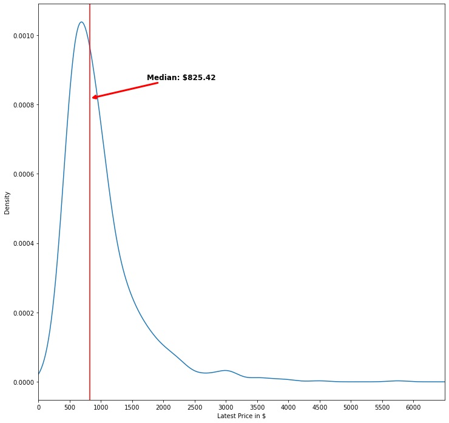
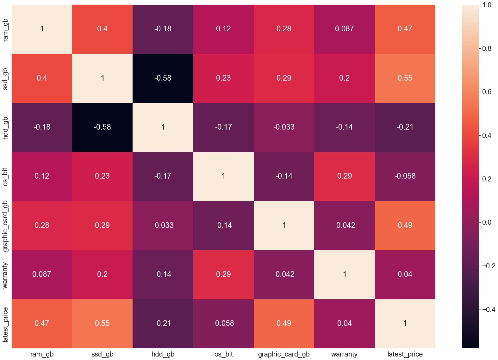
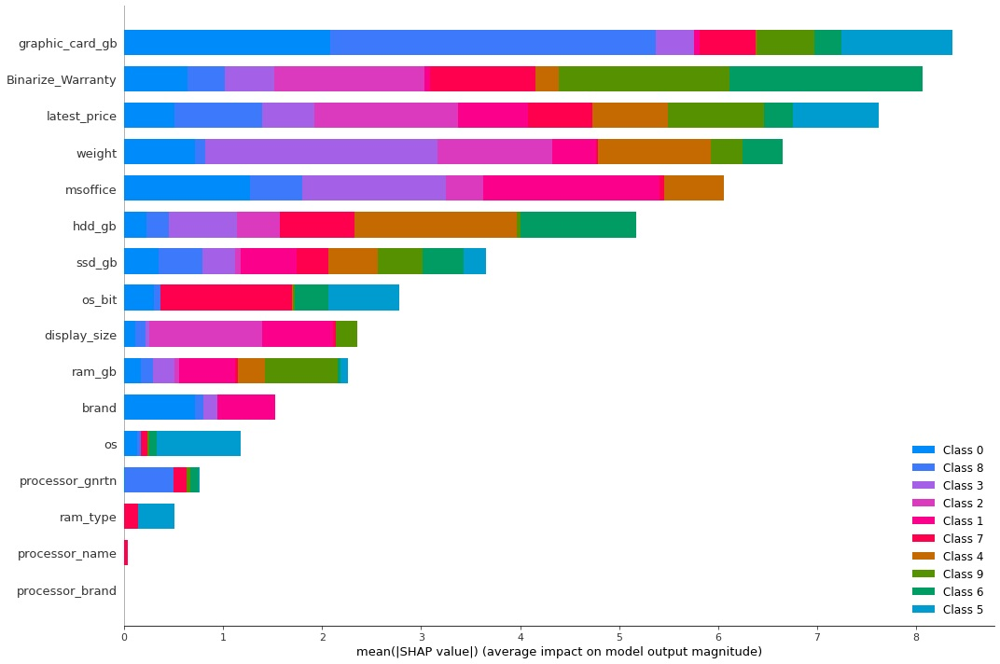
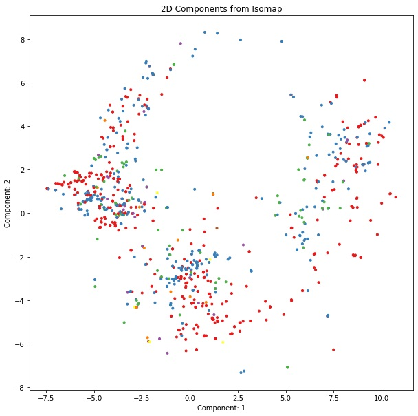
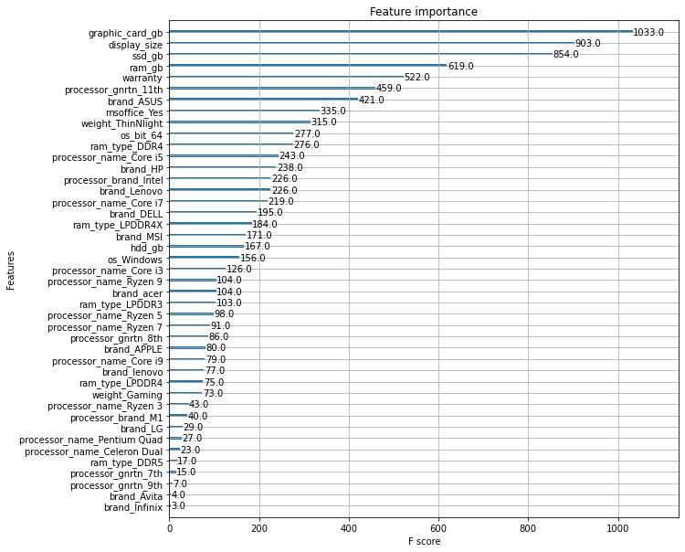

# Laptop Price Modeling

Product pricing is a vital component of any business and having appropriate pricing is key to product success. If a product is overpriced less customers will make the purchase and if it is underpriced then companies will miss out on potential revenue. This project aims to create a machine learning algorithm that can provide information for appropriate pricing based on a laptop's specifications. It will be able to place a laptop into a specific group and give information on the predicted price range of that group.

## 1. Data

The data used came from Kaggle. It was laptop data scrapped from the website Flipkart.com. The dataset had approximately 900 data points. This would be a good beginning data set for proof of concept. 

> [Kaggle Data](https://www.kaggle.com/datasets/kuchhbhi/2022-march-laptop-data)

## 2. Method 

The goal was to first clean the data and choose our ideal features. There are a number of general types of models that could be used for predicting prices.

1. **Regression models** - This is useful for predicting a continuous price and features. While this is good it can be difficult to understand the interaction of all features that can bring together a laptop.
2. **Clustering** - This allows us to group laptops by their specifications and look at a combination of features which describe a laptop's price point. This would be a more ideal algorith to utilize.
3. **Decision Tree** - These algorithms are also able to find pathways which lead to optimal solutions, in this case price categories. 

Ultimately, we chose to focus on clustering but tried other methods such as XGBoost Decision Trees and Isomap.

## 3. Cleaning
[Cleaning Report](https://github.com/naturesbless/LaptopPriceModeling/blob/84b50c4d82c8d3e8d925e2ed41a10953e1e80859/notebooks/Laptop%20Data%20Wrangling.ipynb)

We want to make sure the data is clean and usable. That means removing things like missing data-sets and columns that are not necessary. I started by dropping columns that I felt were not so useful such as customer ratings, old prices, and discount amounts. This information does not provide a lot of depth to our dataset. We moved on to deeper exploration after this.

## 4. EDA
[EDA Report](https://github.com/naturesbless/LaptopPriceModeling/blob/84b50c4d82c8d3e8d925e2ed41a10953e1e80859/notebooks/Laptop%20Data%20EDA.ipynb)

We explored the dataset. The median price of laptops was a reasonable $834. Pricing was spread out pretty consistently across brands except some brands are clearly above. Across features, we saw consistent pricing ranges for all levels which implies a combination of features is more important than a singular feature. We also saw some pretty good correlations with SSD price and Graphic card size and price.

## 5. Modeling
[Pre-Processing Report](https://github.com/naturesbless/LaptopPriceModeling/blob/1ba69064df1bb1591b8e693583ef2735fc70eebb/notebooks/Laptop%20Data%20Pre-processing.ipynb)
[Modeling Report](https://github.com/naturesbless/LaptopPriceModeling/blob/1ba69064df1bb1591b8e693583ef2735fc70eebb/notebooks/Laptop%20Pricing%20Modeling.ipynb)

I chose to utilize a few different packages in order to perform the Machine Learning modeling. We first pre-processed the data by imputing missing data and doing the necessary dummy encoding. 

#5.1 K-Prototype
For K-Prototype I used the [@nicodv](https://github.com/nicodv/kmodes) K-Modes package that can be found [here](https://github.com/nicodv/kmodes). We ended with a 12-cluster model that worked pretty well. 
I used K-Prototype because of its ability to directly measure using categorical variables without its need for dummy encoding. We followed up with SHAP values to understand how much each feature impacted the algorithm's ability to cluster.

#5.2 Isomapping
For Isomapping we used the scikit-learn manifold learning algorithm. It is a dimensionality reduction algorithm which I used to reduce down to two dimensions but due to the overlap, it was difficult to interpret.

#5.3 XGBoost
XGBoost utilized the [@dmlc](https://github.com/dmlc) [XGBoost Algorithm](https://github.com/dmlc/xgboost) and the Python API. Using XGBoost was able to give really good insight into important features for prediction and pricing alongside the ability to understand how certain pricing divisions could be made. 

Ultimately, we went with K-Prototyping for its easy to understand centroids and great adaptability to future points.

## 7. Further Research

Gathering more data on laptop prices and more effective grouping algorithms is always a great start. I think that the data set was a great proof of conccept and beginning point but I would love to see how it deals with larger groups of data. We may find that the XGBoost Decision Trees may be more effective with more data instead of the K-Prototypes. 

## 8. Credits
Thank you to the developers of the sci-kit learn pacakage. Thank you to DMLC for their devleopment of XGBoost. 

Thank you to developer of KModes, [@nicodv](https://github.com/nicodv/kmodes)
